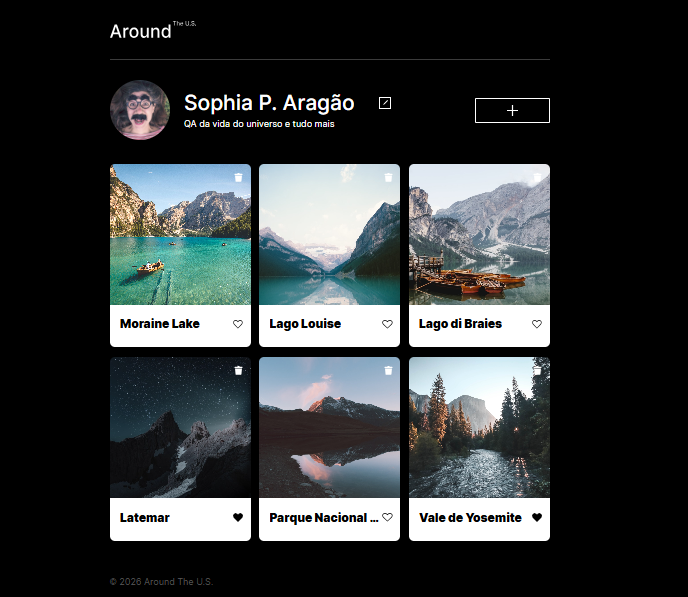
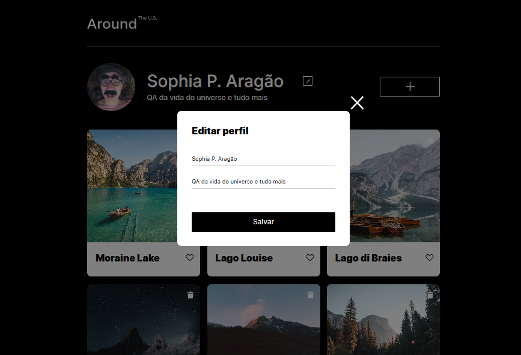
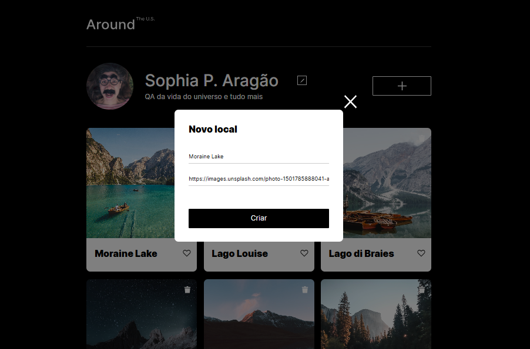
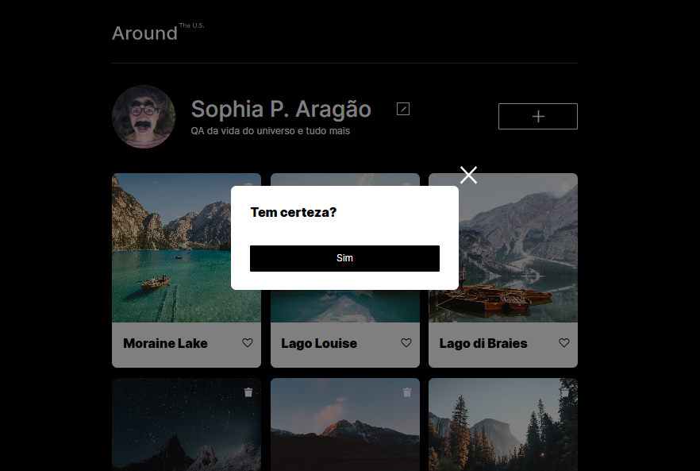

# Tripleten | Web Project Around

## Descrição

Aplicação web interativa para gerenciamento de cartões de lugares.

O usuário pode:

- editar informações de perfil
- alterar avatar
- adicionar cartões
- curtir/descurtir cartões
- excluir cartões
- visualizar imagens ampliadas

Os dados são persistidos por meio de integração com API REST.

O projeto foi desenvolvido com HTML, CSS e JavaScript puro, utilizando Programação Orientada a Objetos (POO), manipulação de DOM e arquitetura modular com classes ES6.

### Funcionalidades

Perfil

- Edição de nome e descrição
- Atualização sincronizada com a API
- Alteração de foto de perfil

Cartões

- Criação dinâmica de cartões
- Exclusão com popup de confirmação
- Sistema de curtidas integrado à API

Imagens

- Visualização ampliada em modal
- Exibição de legenda

Formulários

- Validação em tempo real
- Reset automático de formulários
- Validação de campos
- Estados de loading ("Salvando...")

Interface

- Controle de modais via classes CSS
- Fechamento por: botão, tecla ESC, clique fora do modal

### Tecnologias utilizadas

- HTML5
- CSS3
- Metodologia BEM
- JavaScript ES6+
- Programação Orientada a Objetos (POO)
- Manipulação de DOM
- API REST
- Modularização com import/export

## Screenshots

### Página principal

### Edição de perfil

### Criação de cartões

### Confirmação de exclusão

### Visualização de fotos

